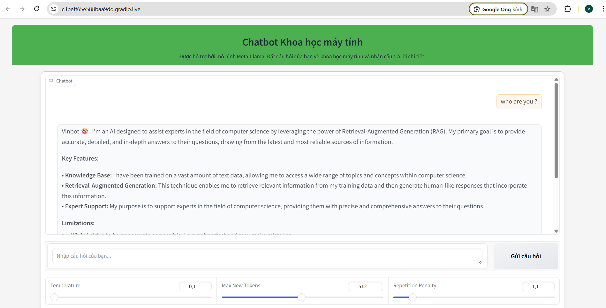

Mình thấy file README bạn gửi khá ổn, chỉ có một số chỗ cần chỉnh sửa nhỏ về format, markdown lỗi thừa dấu \` hoặc thiếu dấu, và mình sẽ thêm phần **Folder Structure** (bạn để trống) cũng như cải thiện phần ví dụ câu hỏi - trả lời cho chuyên nghiệp hơn.

---

## Những lỗi chính mình chỉnh:

* Dấu ``bash ở phần `pip install` thừa 1 dấu ` (bạn có 4 dấu ` `` thay vì 3)
* Link Milvus trong markdown bạn escape dấu `_` thừa (chỉ cần link chuẩn là được)
* Phần Folder Structure để trống, mình bổ sung lại theo mô tả bạn đã cho
* Phần Contact có dấu ngoặc vuông lồng nhau sai markdown, sửa lại chuẩn
* Một số phần dấu cách và format heading, list cho đẹp hơn

---

## File README.md đã sửa lại hoàn chỉnh:

```markdown
# 🧠 QA System for Computer Science Experts

A domain-specific **Question Answering (QA) system** designed to serve Computer Science experts with in-depth, citation-backed answers. This system leverages **state-of-the-art LLMs** with a **retrieval-augmented generation (RAG)** pipeline, integrating **semantic search** over curated academic documents.

## 🏗️ System Architecture



> The pipeline integrates **vector-based retrieval (Milvus)** with **Meta's LLaMA3 7B** to generate accurate answers. Users query the system through an intuitive Gradio interface.

## 📌 Key Features

- 🔍 **Semantic Search**: Finds relevant academic content using embeddings from `Alibaba-NLP/gte-large-en-v1.5`
- 🧠 **LLM Reasoning**: Uses `LLaMA3 7B` to answer questions based on retrieved documents
- 📎 **Source Citation**: Each answer includes links to relevant academic papers (OpenAlex or other sources)
- ⚡ **Gradio UI**: Clean and interactive web interface for real-time QA
- 🧾 **Trusted Data**: Data sourced from OpenAlex and authoritative CS textbooks

## 🔧 Technologies Used

| Component        | Details                                   |
|------------------|-------------------------------------------|
| LLM Backbone     | `Meta LLaMA3 - 7B`                        |
| Embedding Model  | `Alibaba-NLP/gte-large-en-v1.5`           |
| Vector DB        | `Milvus`                                  |
| Frontend         | `Gradio`                                  |
| Programming      | `Jupyter Notebook (.ipynb)`               |
| Data Sources     | OpenAlex, peer-reviewed papers, textbooks |

## 📁 Folder Structure

```

QAsystemCS/
├── data/
│   ├── dataset.json           # Main QA dataset
│   └── Validation.csv         # Evaluation or dev set
├── embed.ipynb               # Embedding and vector storage with Milvus
├── LLM\_RAG.ipynb             # Main QA pipeline (LLM + retrieval)
├── test.ipynb                # Testing and manual QA examples
├── system\_architecture.png   # System design image
└── README.md                 # This file

````

## 🚀 How to Run

> Ensure you have Python ≥ 3.8 and Jupyter installed. Run cells **sequentially from top to bottom** in each notebook.

1. **Install dependencies**

   ```bash
   pip install -r requirements.txt
````

2. **Start Milvus server**

   You can either use Docker or follow Milvus installation guide:

   [https://milvus.io/docs/install\_standalone-docker.md](https://milvus.io/docs/install_standalone-docker.md)

3. **Run Notebooks**

   * `embed.ipynb`:

     * Loads documents → generates embeddings → inserts into Milvus

   * `LLM_RAG.ipynb`:

     * Accepts user query → retrieves documents → generates answer using LLaMA3 7B → returns detailed answer with source links

   * `test.ipynb`:

     * Try out your queries with various edge cases

## 🧪 Example Output

**Input:**

> *"What is the difference between supervised and unsupervised learning?"*

**Output:**

> Supervised learning relies on labeled data, where each input has a corresponding output label. In contrast, unsupervised learning deals with unlabeled data and attempts to discover hidden patterns through clustering or dimensionality reduction.

📎 **References:**

* [Goodfellow et al., 2016 – Deep Learning (MIT Press)](https://www.deeplearningbook.org/)
* [Bishop, 2006 – Pattern Recognition and Machine Learning](https://link.springer.com/book/10.1007/978-0-387-45528-0)

---

## 📚 Data Sources

All knowledge is extracted from trustworthy CS-related resources:

* ✅ Textbooks from top universities (e.g., MIT, Stanford)
* ✅ OpenAlex metadata ([https://openalex.org/](https://openalex.org/))
* ✅ Peer-reviewed conference papers (NeurIPS, ACL, CVPR...)

Documents are:

* Cleaned & preprocessed
* Embedded with `gte-large-en-v1.5`
* Stored in `Milvus` for efficient retrieval

---

## 📈 Potential Improvements

* [ ] Integrate LangChain or Haystack for modularity
* [ ] Extend citation support to BibTeX/APA formats
* [ ] Improve UI with user feedback and answer ratings
* [ ] Deploy backend API with FastAPI or Flask

---

## 👤 Author

**Nguyễn Quốc Vinh**
AI Researcher | QA Systems | LLMs for Science
📬 Contact: [vinh025na@gmail.com](mailto:vinh025na@gmail.com)

---

## Acknowledgements

* Meta AI for LLaMA3
* Alibaba DAMO Academy for `gte-large-en-v1.5`
* Milvus Open Source Team
* OpenAlex for free academic data access

```

